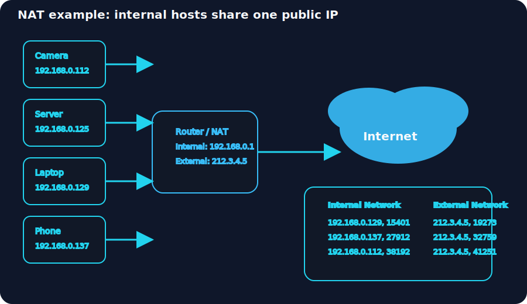

# Networking Essentials

Explore networking protocols from automatic configuration to routing packets to the destination.

## Key Topics

- DHCP (automatic network configuration)
- ARP (address resolution)
- ICMP (diagnostics and error reporting)
- DNS (domain name resolution)
- Routing protocols
- Network Address Translation (NAT)

## Notes

### DHCP: Give Me My Network Settings

A device needs three basic settings to join a network:

- IP address + subnet mask
- gateway/router
- DNS server

DHCP automatically gives devices these values so users don't have to type them manually and the network avoids duplicate IP addresses. It runs over UDP, with the server listening on port 67 and clients using port 68.

DHCP uses the DORA process:

- Discover: client searches for DHCP servers
- Offer: server replies with configuration details
- Request: client asks for a chosen offer
- Acknowledge: server confirms the lease

The message names are:

- DHCPDISCOVER: client broadcasts a request to find a DHCP server
- DHCPOFFER: server offers an available IP address
- DHCPREQUEST: client asks for the offered IP
- DHCPACK: server confirms the assignment

When the client sends DHCPDISCOVER it has no address yet, so it uses source `0.0.0.0` and broadcasts to destination `255.255.255.255` to reach any local DHCP server.

At the end of the exchange, the client has everything needed to use the network and connect to the Internet. The server typically provides:

- the leased IP address for this device
- the gateway to send traffic beyond the local network
- a DNS server to resolve hostnames into IP addresses

### ARP: Bridging Layer 3 Addressing to Layer 2 Addressing

On a local Ethernet or WiFi segment, knowing the IP address is not enough for delivery. The host must also find the MAC address for the destination, and that is what ARP (Address Resolution Protocol) does. ARP translates the target IP into a layer 2 address so the packet can be placed inside a frame.

An Ethernet frame header contains:

- destination MAC address
- source MAC address
- type field (for example, IPv4)

### ICMP: Troubleshooting Networks

ICMP (Internet Control Message Protocol) is a network-layer protocol used mostly for diagnostics and reporting problems rather than carrying user data. It helps devices tell each other when packets cannot be delivered, and it is the foundation for two common troubleshooting commands:

- `ping`: sends ICMP echo requests to a target host and waits for replies. It is useful to check whether the host is reachable and to measure the round-trip time of packets.
- `traceroute` (Linux) / `tracert` (MS Windows): discovers the path packets take from your system to a destination. Each hop along the route responds with an ICMP message, revealing the intermediate routers and where delays or failures occur.

IPv4 packets include a Time-to-Live (TTL) field that limits how many routers the packet can traverse. Each router decrements the TTL by one before forwarding the packet. When TTL reaches zero, the router drops the packet and sends back an ICMP Time Exceeded message (ICMP Type 11). In this context, "time" is counted in routers crossed, not seconds.

These tools are valuable for verifying connectivity, identifying network problems, and understanding the route traffic follows between hosts.

### DNS: Domain Name System

DNS operates at the Application Layer (Layer 7) of the ISO OSI model. It translates human-readable domain names into IP addresses so devices can locate each other on the network. DNS primarily uses UDP port 53 for queries and falls back to TCP port 53 for larger responses.

DNS records store different types of information about domains:

- `A Record`: Maps a hostname to an IPv4 address. For example, `example.com` can resolve to `172.17.2.172`.
- `AAAA Record`: The IPv6 equivalent of an A record, mapping a hostname to an IPv6 address.
- `CNAME Record`: Creates an alias by mapping one domain name to another. For instance, `www.example.com` might point to `example.com` or another domain entirely.
- `MX Record`: Specifies the mail server responsible for accepting and routing email messages for a domain.

DNS is essential for Internet functionality, allowing users to access websites by name rather than remembering IP addresses.

### Routing

Routing protocols help routers share information and build paths through a network. They decide how traffic moves from one place to another by exchanging details about reachable networks and the cost of each route.

- `OSPF` (Open Shortest Path First): a link-state protocol where routers share the status of their directly connected links. Each router constructs a full topology map and calculates the best path to every destination.
- `EIGRP` (Enhanced Interior Gateway Routing Protocol): a Cisco protocol that blends distance-vector and link-state features. Routers share reachable networks and route metrics like bandwidth and delay so they can select efficient paths.
- `BGP` (Border Gateway Protocol): the main protocol for routing between different autonomous systems on the Internet. It lets networks exchange route information and choose paths for traffic that crosses multiple provider networks.
- `RIP` (Routing Information Protocol): a simple, hop-count-based protocol best suited for small networks. Routers advertise the networks they know and choose the routes with the fewest hops.

### NAT: Network Address Translation

NAT allows many internal devices to share a single public IP address for outgoing Internet access. Instead of assigning one public address to each host, a NAT router translates private IP addresses used inside the network into a public address seen by the outside world. This is why a network of twenty computers can all access the Internet through one public IP.

Because IP addressing is allocated in powers of two, using NAT can save public address space. For example, a small network may only need two public addresses instead of thirty-two, which preserves the limited public pool.

Unlike normal routing, NAT devices must keep track of active connections. A NAT router maintains a translation table that maps internal private addresses and ports to external public addresses and ports. Typically, the internal side uses private IP ranges, while the external side uses a public IP address.

Example NAT diagram:

