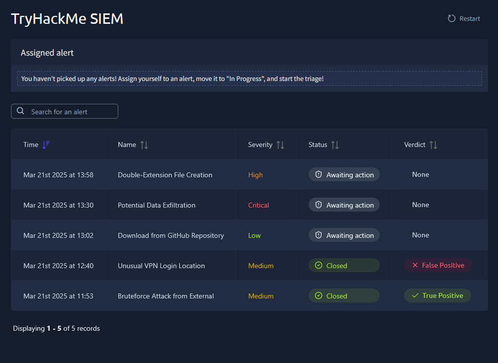
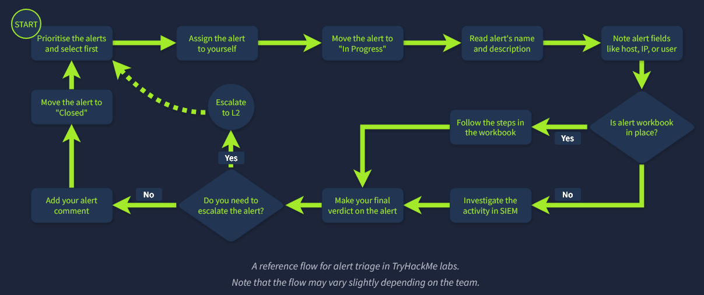
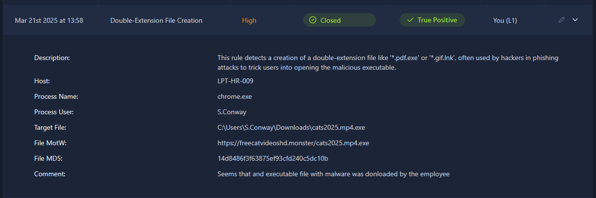
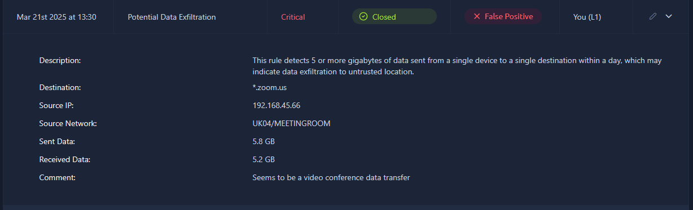
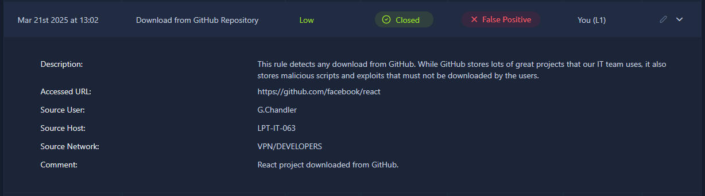

# Section 02 - SOC Team Internals

Notes for alert triage, reporting, operational workflows, and SOC performance tracking.

## Rooms

- [x] SOC L1 Alert Triage
- [ ] SOC L1 Alert Reporting
- [ ] SOC Workbooks and Lookups
- [ ] SOC Metrics and Objectives
- [ ] Introduction to Phishing SOC Simulator Scenario

## Notes

- Add notes for each room as you complete it.

### SOC L1 Alert Triage

#### Learning Objectives

- Familiarise yourself with the concept of an alert.
- Explore alert fields, statuses, and classification.
- Learn how to perform alert triage as an L1 analyst.
- Practice with real alerts and workflows.
- Prepare for the simulator and SAL1 certification.

#### Prerequisites

- Understand common attacks on networks, Windows, and Linux. As an L1 analyst, you should be able to recognize the basic signs of suspicious activity across these environments so you can quickly decide whether an alert is benign, malicious, or needs escalation.
- On networks, focus on patterns such as port scans, brute-force login attempts, unusual outbound traffic, beaconing to external infrastructure, DNS abuse, and unexpected protocol usage between hosts.
- On Windows systems, be familiar with:
	- phishing-delivered malware
	- malicious PowerShell activity
	- suspicious services or scheduled tasks
	- credential dumping attempts
	- privilege escalation
	- lateral movement with remote administration tools
	- persistence through registry or startup changes
- On Linux systems, understand attacks such as:
	- SSH brute forcing
	- abuse of sudo or weak permissions
	- malicious cron jobs
	- web shell deployment
	- unauthorized user creation
	- persistence through startup scripts
	- suspicious command execution tied to crypto mining or remote access
- The goal is not deep incident response at this stage, but enough baseline knowledge to read alerts in context, spot common attacker behaviour, and ask the right escalation questions.
- Know SOC roles and duties, especially those of L1 analysts.

#### Dashboard

You were granted access to the dashboard in the TryHackMe room, and you will need it to complete most of the tasks. Open the attached website in a separate window, familiarise yourself with it, and then move on to the next task.

The dashboard gives you the main analyst view for working through alerts. At a glance, you can see the alert time, name, severity, current status, and verdict. This helps an L1 analyst quickly decide which items need immediate attention, which ones are already being worked, and which have been closed as true positives or false positives.

#### Alert Triage View

The alert triage view is where you pick up an alert, review the available evidence, and decide on the next action. In practice, this means checking the alert details, validating whether the behaviour looks suspicious, updating the status, and assigning a verdict or escalating when the activity is confirmed or needs deeper investigation.

#### Key Recommendations for Alert Investigation

- Start by identifying what is actually under threat, such as the affected user account, hostname, cloud asset, network segment, or website.
- Note the action described in the alert so you understand the suspected activity category, for example a suspicious login, malware-related event, phishing attempt, or data access anomaly.
- Review the surrounding events before and after the alert to look for related suspicious behaviour, follow-on actions, or useful context that helps confirm or dismiss the alert.
- Use threat intelligence platforms and any other available internal or external resources to validate your assumptions, enrich indicators, and strengthen your investigation.

#### Example Alerts to Triage

##### Double-Extension File Creation

This alert suggests that an employee downloaded a file that appears to use a double extension to disguise an executable as something more harmless. That is a common social engineering and malware delivery technique, so the analyst should treat it as suspicious, review the file path and process activity, and check whether the file was executed.

##### Potential Data Exfiltration

This alert appears to show a large or unusual data transfer that may initially look suspicious, but the activity could be explained by legitimate video conference traffic. In this case, the analyst should validate the destination, protocol, user activity, and timing before deciding whether the alert is benign or requires escalation.

##### Download GitHub Repository

This alert shows a React project being downloaded from GitHub. On its own, this may be normal developer activity rather than malicious behaviour, so the analyst should check which user performed the action, whether the host is used for development work, and whether the repository or download pattern matches expected business activity.

